<div align="center">

# 🏬 Makassar Store — Sistem Kasir Berbasis Web

[](https://php.net)
[](https://mysql.com)
[](https://apachefriends.org)
[](LICENSE)

Proyek tugas akhir — sistem kasir web sederhana yang saya buat sendiri pakai PHP native dan MySQL, tanpa framework apapun. Didesain dengan tampilan dark-mode yang nyaman di mata dan bisa langsung dipakai di XAMPP.

</div>

---

## Tentang Proyek

Makassar Store adalah aplikasi Point of Sale (POS) berbasis web yang saya kembangkan sebagai tugas kuliah. Memang tujuan awalnya cuma buat tugas, tapi saya usahain supaya fitur-fiturnya beneran bisa dipakai — mulai dari kelola produk, proses transaksi, sampai laporan penjualan yang bisa diekspor ke Excel.

Nama *Makassar Store* sendiri saya ambil karena saya orang Makassar 😄 dan slogannya juga saya bikin sendiri:

> *"Belanja Mudah, Hidup Berkah — Khas Makassar"*

---

## Fitur yang Ada

| Modul | Keterangan |
|---|---|
| 🔐 Login & Register | Ada sistem kode registrasi supaya nggak sembarangan orang bisa daftar |
| 📊 Dashboard | Ringkasan omset hari ini, grafik penjualan 7 hari, stok kritis, transaksi terakhir |
| 🛒 Transaksi / POS | Pilih produk, atur qty, bayar, langsung keluar struk |
| 📦 Manajemen Barang | Tambah, edit, hapus produk + pantau stok |
| 🏷️ Kategori | Pengelompokan barang biar lebih rapi |
| 👥 Member | Data pelanggan, sistem poin, riwayat belanja |
| 📈 Laporan | Filter by tanggal/metode/member, grafik, ekspor ke Excel |
| 👤 Profil | Tiap user bisa ganti nama, email, dan password sendiri |

---

## Tampilan Aplikasi

Berikut screenshot dari tiap halaman utama sistemnya.

---

### 1. Halaman Login

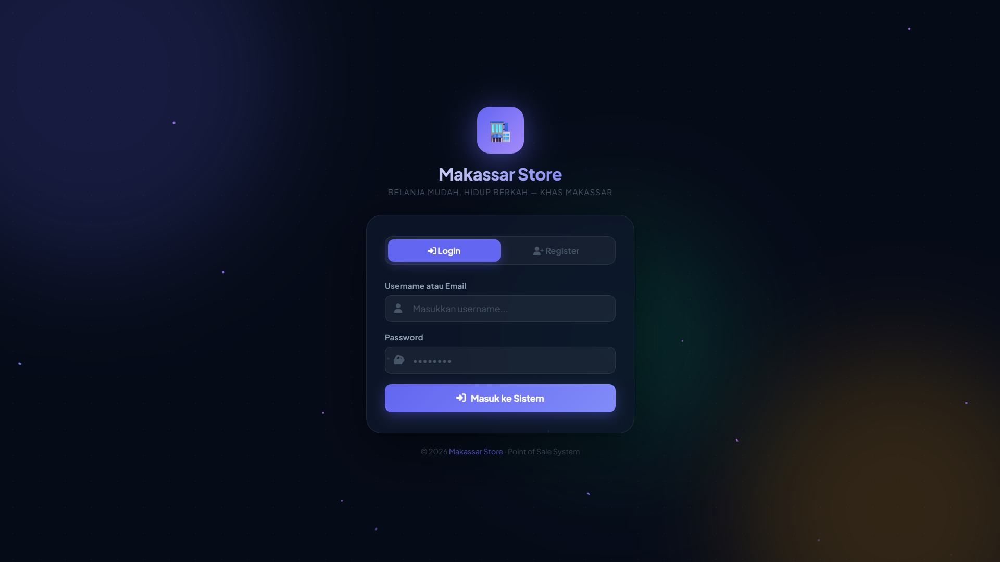

Halaman pertama yang muncul saat buka aplikasi. Ada form login biasa dan tombol ke halaman register. Background-nya pakai animasi partikel bintang yang bergerak pelan — efeknya lumayan bikin tampilannya hidup. Di bagian tengah ada logo dan nama toko.

---

### 2. Halaman Register

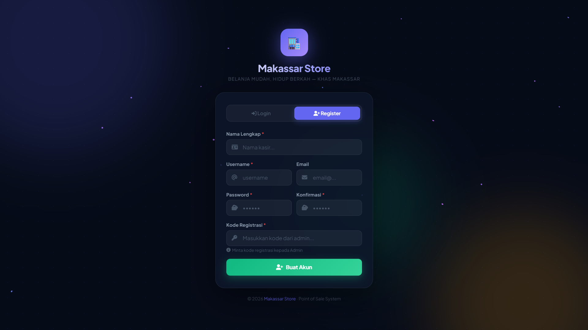

Form pendaftaran akun baru. Ada input nama, username, email, password, dan satu field khusus: **kode registrasi**. Kode ini harus diisi dengan benar supaya bisa daftar — ini cara saya biar orang yang nggak berkepentingan nggak bisa sembarangan bikin akun. Kode defaultnya `MKSTR2026`.

---

### 3. Dashboard — Statistik Utama

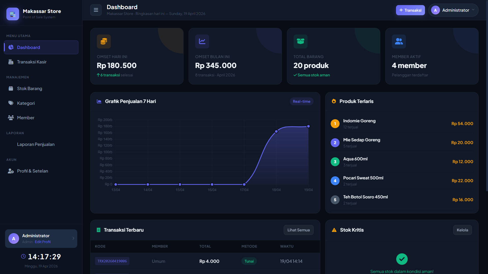

Ini halaman utama setelah masuk. Di bagian atas ada empat kartu statistik: omset hari ini, omset bulan ini, total produk aktif, dan jumlah member. Di bawahnya ada grafik bar penjualan 7 hari terakhir dan grafik donut untuk 5 produk terlaris. Semua data realtime dari database.

---

### 4. Dashboard — Transaksi & Stok Kritis

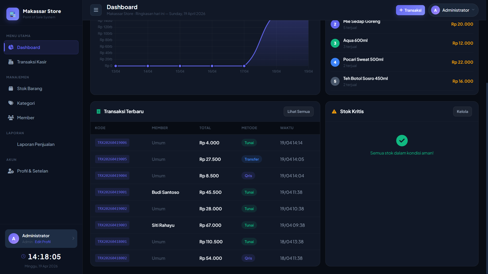

Bagian bawah dashboard. Sebelah kiri ada tabel transaksi terbaru — tampil kode transaksi, nama kasir atau member, metode pembayaran (Tunai/QRIS/Transfer), dan total. Sebelah kanan ada daftar produk yang stoknya sudah menipis, jadi bisa langsung tahu produk mana yang perlu segera diisi ulang.

---

### 5. Halaman Transaksi (POS)

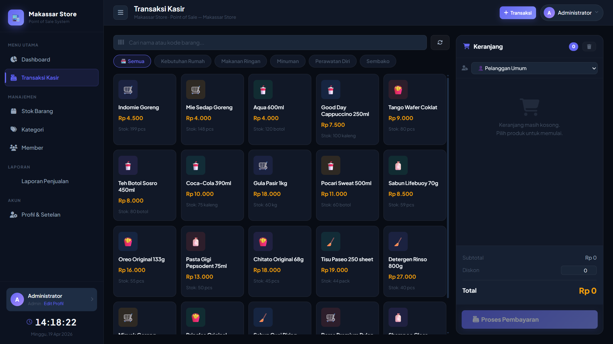

Ini halaman kasir yang saya desain supaya nyaman dipakai. Sebelah kiri ada grid produk yang bisa difilter per kategori atau dicari pakai searchbar (support scan barcode juga). Tiap produk ditampilkan dengan nama, harga, dan info stok. Sebelah kanan ada keranjang belanja yang update otomatis saat produk dipilih.

---

### 6. Modal Pembayaran

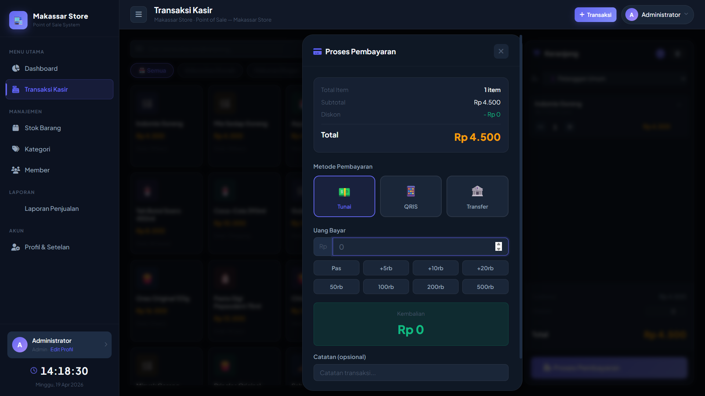

Dialog yang muncul waktu klik tombol bayar. Bisa pilih metode pembayaran: Tunai, QRIS, atau Transfer Bank. Kalau pilih Tunai, ada input uang yang diterima — kembaliannya otomatis dihitung. Ada juga tombol nominal cepat (50rb, 100rb, dll.) biar nggak perlu ketik manual. Bisa juga input member kalau pelanggannya punya kartu.

---

### 7. Struk Digital (Preview)

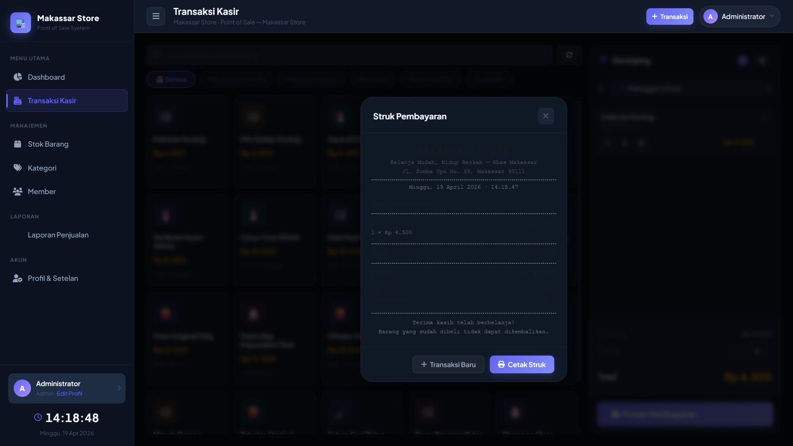

Tampilan pratinjau struk setelah transaksi berhasil diproses. Di sini muncul semua detail transaksi: kode unik, tanggal dan jam, daftar barang yang dibeli, total bayar, dan kembalian. Ada dua tombol di bawah — satu untuk cetak struk fisik, satu lagi untuk langsung mulai transaksi baru.

---

### 8. Cetak Struk (Format Thermal)

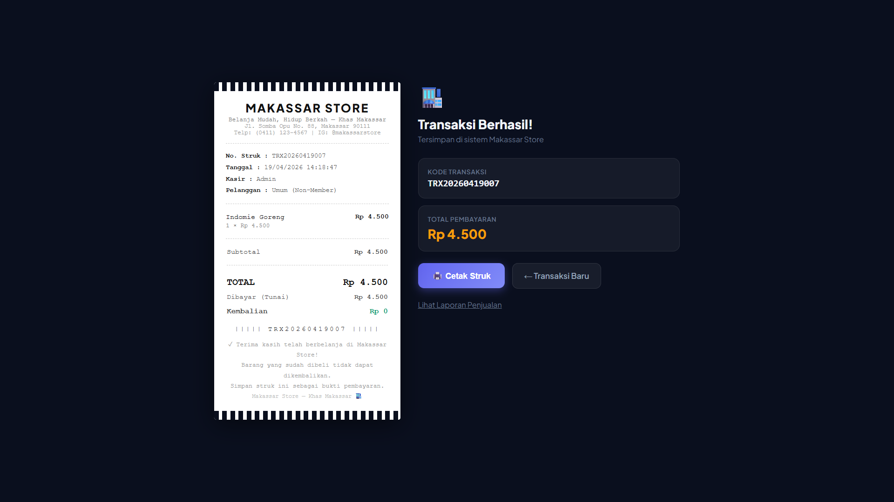

Tampilan struk versi print, diformat sesuai ukuran kertas thermal printer standar (58mm atau 80mm). Isinya nama toko, alamat, nomor transaksi, detail item dengan qty dan harga satuan, total, uang bayar, kembalian, dan ucapan terima kasih di bawah.

---

### 9. Manajemen Barang

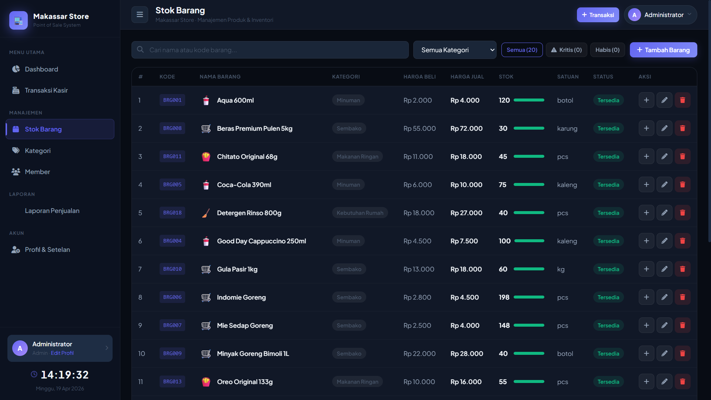

Halaman untuk kelola semua produk. Tampilannya tabel dengan kolom: kode barang, nama, kategori, harga beli, harga jual, stok (dengan progress bar warna), satuan, dan status aktif/nonaktif. Ada juga tombol tambah stok yang langsung bisa dipakai tanpa harus masuk ke form edit dulu.

---

### 10. Manajemen Kategori

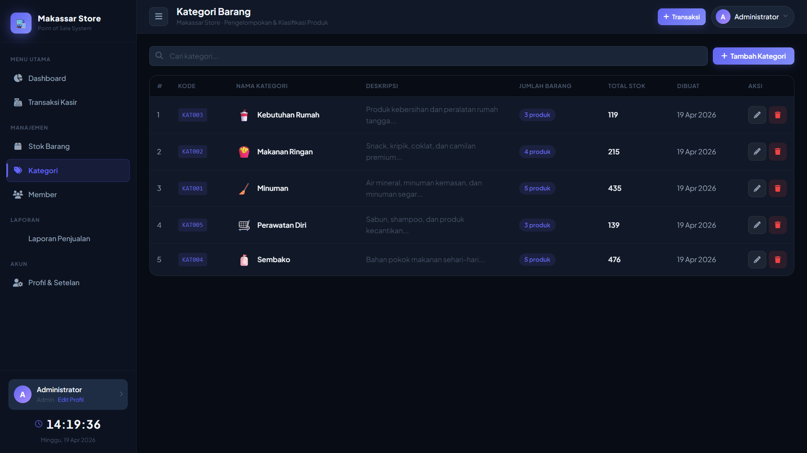

Tabel kategori produk. Tiap kategori ditampilkan dengan icon emoji, nama, deskripsi, jumlah produk di bawahnya, total stok gabungan, dan tanggal dibuat. Bisa tambah, edit, atau hapus kategori dari sini.

---

### 11. Manajemen Member

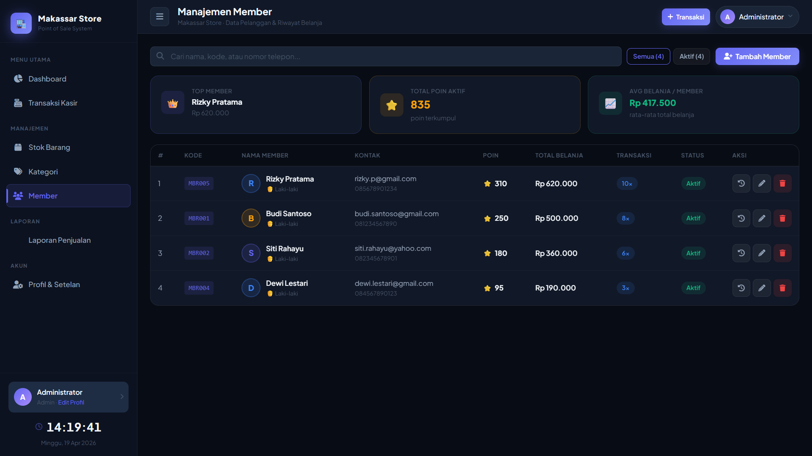

Data pelanggan yang terdaftar sebagai member. Tampil nama, nomor telepon, total belanja keseluruhan, jumlah transaksi, poin loyalitas yang terkumpul, dan status aktif/nonaktif. Di bagian atas ada ringkasan singkat: total member aktif, total poin beredar, dan member baru bulan ini.

---

### 12. Laporan Penjualan — Ringkasan & Grafik

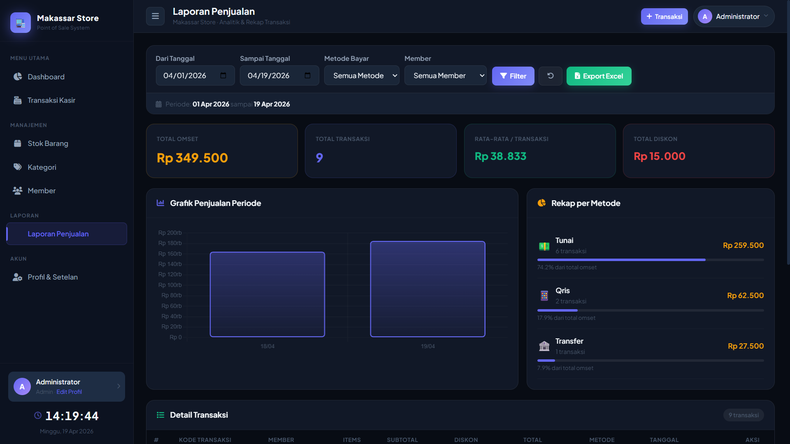

Halaman laporan dengan filter tanggal, metode pembayaran, dan member. Setelah filter dijalankan, tampil ringkasan: total omset, jumlah transaksi, rata-rata per transaksi, dan total diskon. Di bawahnya ada grafik garis penjualan per hari dan tabel rekap per metode pembayaran.

---

### 13. Laporan Penjualan — Detail Transaksi

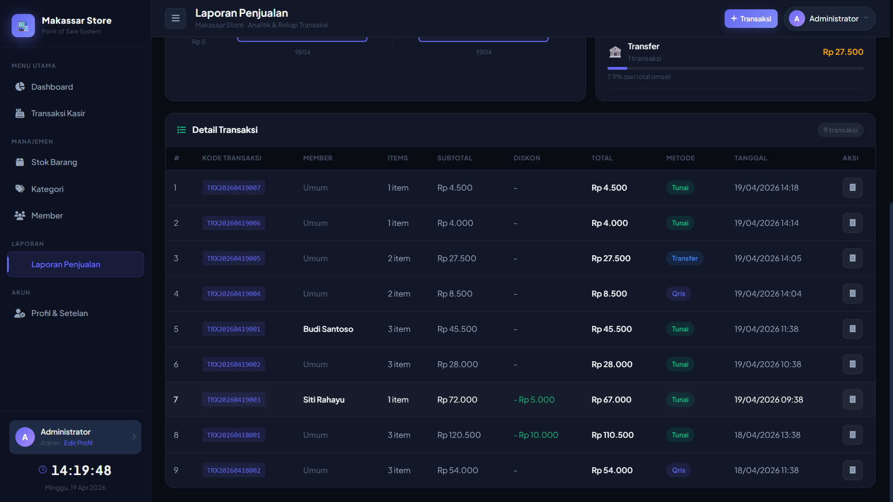

Tabel detail tiap transaksi dalam periode yang dipilih. Kolom yang tampil: kode transaksi, nama kasir, member (kalau ada), jumlah item, subtotal, diskon, total, metode bayar, dan waktu transaksi. Bisa discroll ke bawah kalau datanya banyak.

---

### 14. Profil — Edit Data Akun

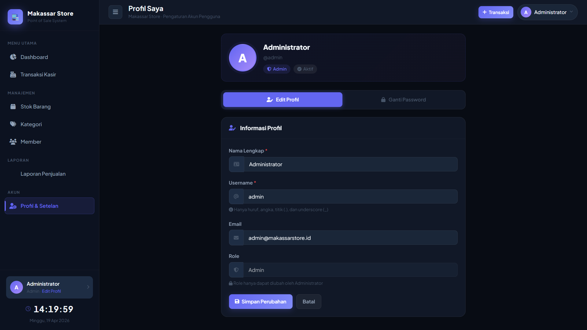

Halaman pengaturan akun pribadi. Setiap user bisa ubah nama lengkap, username, dan email dari sini. Role (Admin/Kasir) nggak bisa diubah sendiri — hanya Admin yang bisa ubah role orang lain.

---

### 15. Profil — Ganti Password

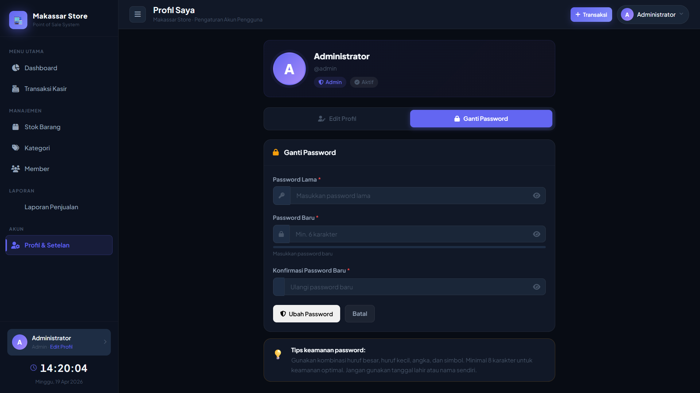

Form ganti password dengan tiga field: password lama (untuk verifikasi), password baru, dan konfirmasi password baru. Ada indikator kekuatan password realtime yang berubah warna sesuai tingkat keamanannya — hijau kalau kuat, merah kalau masih lemah.

---

### 16. Export Excel

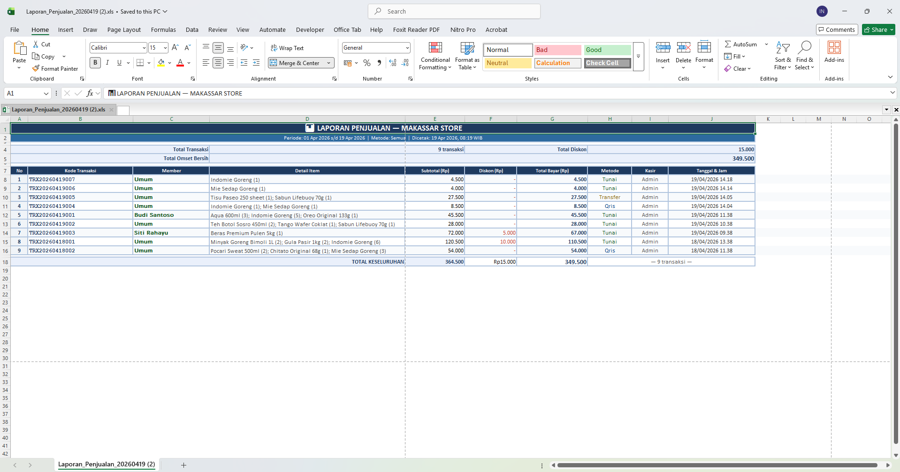

Hasil ekspor laporan ke format `.xls`. File langsung otomatis terdownload saat klik tombol Export di halaman laporan. Isinya sudah terformat rapi: ada judul laporan, periode, ringkasan statistik di bagian atas, lalu tabel detail transaksi di bawahnya.

---

## Teknologi yang Dipakai

| Layer | Detail |
|---|---|
| Backend | PHP 8.x (native, tanpa framework) |
| Database | MySQL 8.x via `mysqli` |
| Frontend | HTML5, CSS3 (vanilla), JavaScript |
| Grafik | Chart.js (via CDN) |
| Icon | Font Awesome 6.5 |
| Font | Plus Jakarta Sans (Google Fonts) |
| Server | XAMPP (Apache + MySQL) |

---

## Cara Instalasi

**Kebutuhan sistem:**
- XAMPP (Apache + MySQL)
- PHP 8.0 ke atas
- Browser modern

**Langkah-langkahnya:**

**1. Download atau clone repo ini**
```bash
git clone https://github.com/username/makassar-store.git
```

**2. Taruh foldernya di direktori htdocs**
```
C:\xampp\htdocs\kasir\
```

**3. Nyalakan Apache dan MySQL di XAMPP Control Panel**

**4. Import database**
- Buka `http://localhost/phpmyadmin`
- Buat database baru: `makassar_store`
- Import file `makassar_store.sql` yang ada di root folder

**5. Cek konfigurasi database** — edit `config/database.php` kalau perlu:
```php
define('DB_HOST', 'localhost');
define('DB_USER', 'root');    // username MySQL kamu
define('DB_PASS', '');        // password MySQL kamu (default kosong)
define('DB_NAME', 'makassar_store');
```

**6. Buka di browser:**
```
http://localhost/kasir/
```

---

## Akun Default

Setelah import database, langsung bisa login dengan:

| Role | Username | Password |
|---|---|---|
| Admin | `admin` | `admin123` |

> **Catatan:** Segera ganti password setelah pertama kali masuk, lewat menu Profil → Ganti Password.

Untuk daftarkan kasir baru, gunakan kode registrasi: **`MKSTR2026`**
*(Bisa diubah di `config/database.php` → konstanta `REGISTER_CODE`)*

---

## Struktur Folder

```
kasir/
├── assets/
│   └── css/
│       └── style.css
├── config/
│   └── database.php
├── documentasi/           ← screenshot tiap halaman
│   ├── 1_login.png
│   ├── 2_register.png
│   └── ... (16 file)
├── includes/
│   ├── auth.php
│   ├── header.php
│   └── footer.php
├── dashboard.php
├── transaksi.php
├── barang.php
├── kategori.php
├── member.php
├── laporan.php
├── profil.php
├── struk.php
├── login.php
├── logout.php
├── makassar_store.sql
└── README.md
```

---

## Lisensi

Proyek ini dibuat untuk keperluan tugas kuliah dan boleh dipakai atau dimodifikasi bebas.

---

<div align="center">

Dibuat sendiri oleh mahasiswa Makassar 🌊  
**Makassar Store POS v3.0** · 2026

</div>
